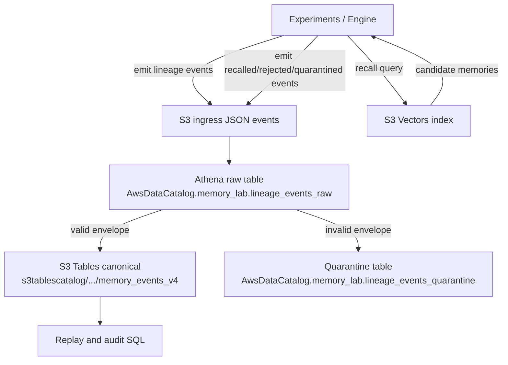

# Memory Lab

An experimental AWS-native memory lab — not a production memory product.

The goal is to test how synthetic memory behaves when it must **form and revise beliefs**, not merely retrieve text in plausible order.

Security posture is explicit: **constrain blast radius** at every layer (runtime roles, ingestion roles, replay/audit roles, storage paths, and query surfaces).

## Why this project exists

Not to build “better retrieval,” but to test a stronger claim:

> **Memory should be treated as a belief-control system, not a fact store.**

That means:
- recall is reconstruction,
- reconstructed output is belief (not reality),
- and what matters is whether memory is **eligible to influence future action**.

## Memory model positioning

Most agent harnesses (and most early systems) stop at the encode/store/retrieve loop.
This lab targets the next layer: governed memory control (admission, influence gating, decay,
promotion/suppression, contradiction persistence, contamination handling, and replayable lineage).

See:
- `specs/IMPLICIT_MEMORY_SPEC.md`

## Core concepts

1. **Memory ≠ reality**
   - Reality is observer-independent.
   - Memory is internal, lossy, mutable, and context-conditioned.
   - Vocabulary must distinguish: `reality`, `evidence`, `claim`, `memory`, `belief`.

2. **The frontier is eligibility, not storage**
   - Top-k retrieval alone is epistemically unsafe.
   - Influence is gated by policy dimensions:
     - relevance
     - trust
     - recency
     - reinforcement
     - consistency
     - safety

3. **Dual-plane design is the key machine advantage**
   - **Cognitive plane** can mutate (decay, consolidation, reconsolidation, promotion, suppression).
   - **Lineage plane** must remain immutable, append-only, and replayable.
   - Project invariant:
     > **memory may mutate; lineage must not**

4. **Poisoning is a first-class threat**
   - High-trust falsehoods can dominate if trust is conflated with truth.
   - Quarantine, suspicion labels, and rejection reasons must be deterministic and machine-readable.

5. **Belief health is adaptive, not maximal retention**
   - Healthy memory = remember enough to act, forget enough to stay plastic, distrust enough to resist capture.

## Non-negotiable invariants

1. Memory behavior can change; lineage history must not be rewritten.
2. S3 Tables is canonical lineage (`memory_lab.memory_events_v4`).
3. S3 Vectors is a rebuildable recall index, not source of truth.
4. Contradictions are not auto-resolved.
5. IAM and data-plane permissions must **constrain blast radius** by default (least privilege, explicit denies, role separation).

## Architecture and flow

## Event envelope (required)

Every event must include:
- `event_id`, `event_type`, `agent_id`, `stream_id`, `memory_id`
- `event_time`, `schema_version`, `payload`
- `actor_class`, `source_class`
- `parent_event_id` (nullable)

## Experiments

Implemented runners: `e1` through `e12`.

See:
- `src/experiments/README.md`
- `specs/EXPERIMENTS.md`

## Success criteria

The lab should demonstrate:

1. Belief change from experience (not retrieval-order artifacts).
2. Conflict persistence without forced collapse.
3. Quarantine handling for suspicious or poisoned memory.
4. Replay/rebuild consistency from canonical lineage.

## Quick operations

Use `Makefile` targets from repo root:

- `make synth` / `make deploy`
- `make exp-e1` … `make exp-e12`
- `make ingest-preflight` (schema/projection check)
- `make ingest`
- `make phase4-audit` / `make phase5-audit` / `make phase6-audit`
- `make lab-regression`

## Working notes

- Runtime defaults come from `.env` / `.env.example`.
- Python execution/deps use `uv`.
- Prefer replay-first, auditable changes.
- Constrain blast radius in every change: separate principals, scope permissions to exact resources/prefixes, and add explicit deny where possible.

## Key docs

- `AGENTS.md`
- `specs/ENGINEERING_SPEC.md`
- `notes/SYSTEMATIZATION_PLAN_V1.md`
- `notes/IAM_HARDENING_PLAN.md`
- `notes/IAM_IMPLEMENTATION_CHECKLIST.md`
- `src/experiments/sql/`

## Guiding principle

> Use biological inspiration for adaptation, machine guarantees for auditability, and least-privilege controls to constrain blast radius.
