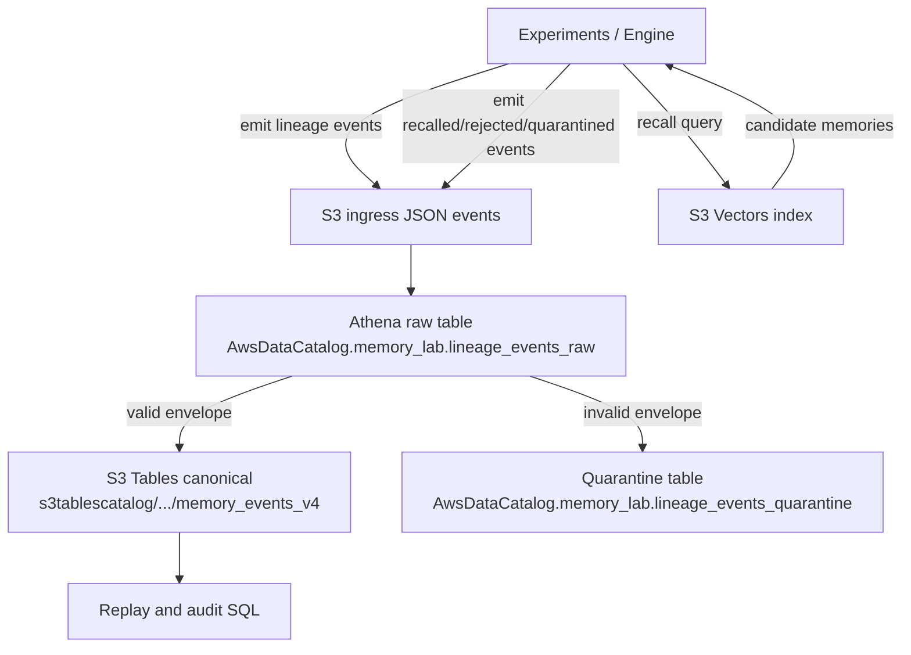

# Memory

An experimental **memory lab**-not a production memory product. The goal is to probe how synthetic memory behaves when it must **form and revise beliefs**, not merely **retrieve** text in plausible order.

## Core thesis

Memory is not storage. It is a **control system**: past signals gate how strongly they may influence future computation.

## What this lab is

A small AWS-native lab for testing memory as belief control.

- Cognitive behavior can change.
- Lineage must stay append-only and replayable.
- Canonical lineage table: `memory_lab.memory_events_v4`.

## Architecture and flow

## Experiments

Implemented runners: `e1` through `e8`.

See:
- `src/experiments/README.md`
- `specs/EXPERIMENTS.md`

## Success criteria

The lab should demonstrate:

1. Belief change from experience (not retrieval order artifacts).
2. Conflict persistence without auto-collapse.
3. Quarantine handling for suspicious/poisoned memory.
4. Replay/rebuild consistency from canonical lineage.

## Working notes

- Use `Makefile` for command options.
- Use `.env` / `.env.example` for runtime defaults.
- Run `make ingest-preflight` before ingestion to verify canonical schema alignment.

## Key docs

- `AGENTS.md`
- `specs/ENGINEERING_SPEC.md`
- `notes/SYSTEMATIZATION_PLAN_V1.md`
- `src/experiments/sql/`

## Guiding principle

Use biological inspiration for adaptation, and machine guarantees for auditability.
