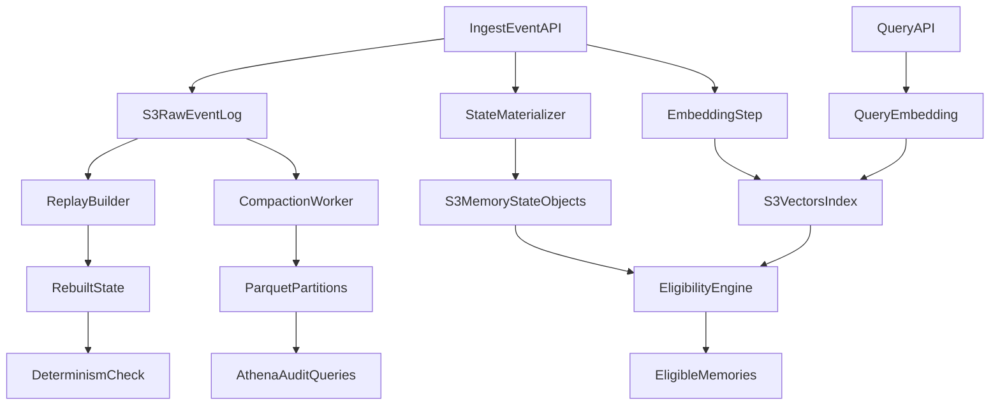

# Initial Build Plan

## Scope and Success Target
Ship a narrow v0 that proves the core thesis: the system changes **belief state**, not only retrieval order, while preserving immutable lineage and replayability.

Success for v0:
- Ingest events append-only into lineage storage.
- Materialize current memory state from events.
- Retrieve candidates via vector similarity, then gate with eligibility.
- Persist conflicts and quarantine without auto-resolution.
- Rebuild state deterministically from event history.

## Source-Aligned Constraints
This plan follows requirements from:
- [`/Users/macos-user/.projects/stack-research/memory/AGENTS.md`](/Users/macos-user/.projects/stack-research/memory/AGENTS.md)
- [`/Users/macos-user/.projects/stack-research/memory/specs/ENGINEERING_SPEC.md`](/Users/macos-user/.projects/stack-research/memory/specs/ENGINEERING_SPEC.md)
- [`/Users/macos-user/.projects/stack-research/memory/specs/BROAD_EXPERIMENT_SPEC.md`](/Users/macos-user/.projects/stack-research/memory/specs/BROAD_EXPERIMENT_SPEC.md)
- [`/Users/macos-user/.projects/stack-research/memory/notes/AUDITABILITY.md`](/Users/macos-user/.projects/stack-research/memory/notes/AUDITABILITY.md)
- [`/Users/macos-user/.projects/stack-research/memory/notes/NOTES.md`](/Users/macos-user/.projects/stack-research/memory/notes/NOTES.md)
- [`/Users/macos-user/.projects/stack-research/memory/notes/AMENDED_NOTES.md`](/Users/macos-user/.projects/stack-research/memory/notes/AMENDED_NOTES.md)

Non-negotiables to enforce from day one:
- Cognitive plane can mutate; lineage plane cannot.
- Vectors influence recall only; lineage/parquet explains recall.
- Every vector and parquet row remains traceable to event identity.

## v0 Architecture Slice

## Implementation Sequence

### 1) Define canonical contracts first
- Create strict event schema (`event_id`, `sequence`, `event_type`, `memory_id`, `payload`, `source`, `timestamp`).
- Create memory-state schema (`trust_score`, `confidence`, `decay_score`, `status`, conflict links, lineage pointers).
- Define metadata contract for vector rows (`source_event_id` or `source_payload_hash` required).

### 2) Build append-only lineage path
- Implement write-only event ingestion module and object key strategy for ordered replay.
- Add tombstone event handling (`deleted`) rather than mutation of prior events.
- Add idempotency guard on `event_id` + `sequence`.

### 3) Build state materialization pipeline
- Implement pure reducer from ordered event stream to current memory state.
- Persist materialized memory objects in separate active/quarantined/deleted prefixes.
- Keep reducer deterministic and side-effect free for replay tests.

### 4) Add retrieval + eligibility gating
- Implement query embedding + top-k vector retrieval.
- Apply eligibility function: `relevance * trust * recency * reinforcement * consistency * safety`.
- Enforce status hard denies (quarantined/deleted never eligible).

### 5) Add conflict and quarantine primitives
- Implement explicit conflict records (`contradicts`/`supports`) as first-class links.
- Never auto-resolve contradictions.
- Add quarantine action that sets eligibility effectively to zero.

### 6) Add replay and audit endpoints
- Implement rebuild job: replay event log -> regenerated state snapshot.
- Implement minimal API surface for `current beliefs`, `lineage by memory`, and `diff between timestamps`.
- Add deterministic equality check between live and rebuilt state.

### 7) Add cold-path compaction scaffold
- Implement raw JSON to Parquet compaction partitioned by date/hour.
- Register Glue table schemas and baseline Athena queries for replay checks and poisoning/drift analysis.
- Ensure parquet rows include raw event identity fields for traceability.

### 8) Run first experiment harnesses (E1, E4, E6, E7)
- E1 trust-vs-truth selection behavior.
- E4 contradiction persistence under retrieval.
- E6 poisoning injection and quarantine.
- E7 full replay integrity.

## Minimal Deliverables by Module
- Python service skeleton for API + workers.
- Event ingestion module (append-only).
- Deterministic state reducer/materializer.
- Retrieval and eligibility module.
- Conflict/quarantine module.
- Replay verifier + baseline audit endpoints.
- Compaction script and Athena-ready parquet layout.
- Experiment scripts for E1/E4/E6/E7 with report outputs.

## Risks and Early Mitigations
- Schema drift risk -> versioned event and state schemas with compatibility checks.
- Undetected non-determinism -> fixed ordering rules + replay golden tests.
- Retrieval hiding belief bugs -> compare retrieval scores and post-eligibility selections in logs.
- Poisoning spread ambiguity -> require lineage links in all promotion/mutation events.

## Acceptance Gates for Initial Build
- Can ingest and replay same event corpus to identical state output.
- Can demonstrate conflict persistence without silent collapse.
- Can quarantine poisoned memory and exclude it from influence.
- Can explain each eligible memory by source event lineage.
- Can drop/rebuild vector index from durable event/parquet lineage data.
