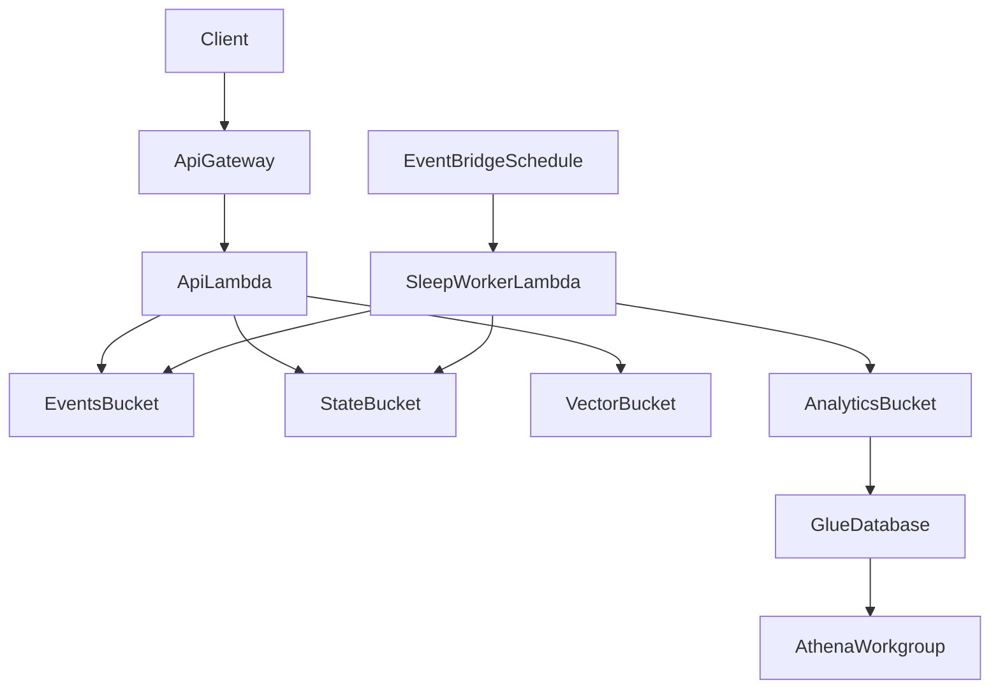

# CDK Backend Infrastructure Plan

## Goal
Provision AWS infrastructure for the current backend architecture using Python CDK, and connect it to minimal function entry points aligned to the existing service modules.

## Current Code Anchors
- Settings/env contract: [`/Users/macos-user/.projects/stack-research/memory/src/memory_lab/config.py`](/Users/macos-user/.projects/stack-research/memory/src/memory_lab/config.py)
- Orchestration/service logic: [`/Users/macos-user/.projects/stack-research/memory/src/memory_lab/service.py`](/Users/macos-user/.projects/stack-research/memory/src/memory_lab/service.py)
- Compaction logic: [`/Users/macos-user/.projects/stack-research/memory/src/memory_lab/compaction.py`](/Users/macos-user/.projects/stack-research/memory/src/memory_lab/compaction.py)
- Experiment runner and entrypoint shape: [`/Users/macos-user/.projects/stack-research/memory/scripts/run_experiments.py`](/Users/macos-user/.projects/stack-research/memory/scripts/run_experiments.py)

## Proposed Stack Shape (Hybrid Minimal)

## Implementation Plan

### 1) Create Python CDK app scaffold
- Add `infra/` CDK app (Python) with `app.py`, `cdk.json`, requirements, and stack package.
- Add environment-aware context loading from existing config keys (`AWS_PROFILE`, buckets, region).
- Add deploy docs that explicitly use profile `stack-research`.

### 2) Add foundational storage/data stack
- Create `MemoryDataStack` with:
  - events S3 bucket (append-only lineage source-of-truth)
  - state S3 bucket (materialized cognitive state)
  - analytics S3 bucket/prefix for parquet
  - retrieval-plane vector bucket placeholder config (respect boundary rule)
- Add secure defaults (versioning, encryption, block public access).
- Export bucket names/arns as stack outputs and parameter store values for function wiring.

### 3) Add minimal compute stack (Lambda-first API + scheduler)
- Create `MemoryComputeStack` with:
  - API Lambda (thin wrapper for ingest/retrieve/audit calls)
  - Sleep/compaction Lambda (scheduled via EventBridge)
  - API Gateway for minimal endpoints
- Inject env vars into Lambdas using the existing names already used by `Settings.from_env()`.
- Grant least-privilege IAM access to only required S3 prefixes and Athena/Glue actions.

### 4) Add backend function adapters
- Add `src/memory_lab/handlers/` with Lambda handlers that call current service methods:
  - ingest handler -> `MemoryLabService.ingest_event()`
  - retrieve handler -> `MemoryLabService.retrieve()`
  - audit handler -> `AuditAPI` methods
  - sleep/compaction handler -> compaction/replay functions
- Keep adapter layer thin so domain logic remains in existing modules.

### 5) Add API contract and routing
- Define initial routes:
  - `POST /events`
  - `POST /retrieve`
  - `GET /beliefs/current`
  - `GET /memory/{id}/lineage`
- Normalize request/response schema and error envelopes.

### 6) Add deployment and local run workflow
- Document bootstrap/deploy commands for profile `stack-research`.
- Add Makefile or scripts for:
  - synth
  - deploy
  - destroy
  - invoke sample events
- Add `.env` and CDK context mapping guidance to avoid drift between local and cloud config.

### 7) Add verification checks
- Add infra smoke test checklist:
  - deploy succeeds
  - API endpoint reachable
  - scheduled sleep lambda triggers
  - compaction writes analytics partition path
- Add one integration test script that calls API ingest+retrieve and verifies artifacts in S3.

## Deliverables
- `infra/` Python CDK app with at least two stacks: data + compute.
- Lambda handlers connected to current backend modules.
- API Gateway exposing minimal backend endpoints.
- EventBridge schedule for sleep/compaction path.
- Deployment docs and smoke test script.

## Sequencing Notes
- Build data stack first, then compute stack, then handler adapters.
- Keep workers minimal and callable; deeper worker decomposition can follow after this infrastructure baseline is stable.
