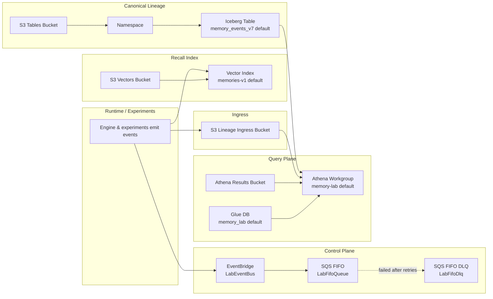

# Stacks: Memory Lab Infrastructure

This directory contains AWS CDK infrastructure for the memory lab backend.

## Stack implemented

- `stacks/memory_lab/memory_lab_stack.py`
- Stack class: `MemoryLabStack`

## What this stack creates

### 1) S3 Vectors (recall index)

- **Vector bucket** (`aws_s3vectors.CfnVectorBucket`)
  - Name from `AWS_S3_VECTOR_BUCKET_NAME` (required)
- **Vector index** (`aws_s3vectors.CfnIndex`)
  - `index_name`: `AWS_S3_VECTOR_INDEX_NAME` (default: `memories-v1`)
  - `dimension`: `AWS_S3_VECTOR_INDEX_DIMENSION` (default: `1536`)
  - `data_type`: `float32`
  - `distance_metric`: `cosine`
  - Depends on vector bucket

### 2) S3 Tables (canonical lineage)

- **Table bucket** (`aws_s3tables.CfnTableBucket`)
  - Name from `AWS_S3_TABLE_BUCKET_NAME` (required)
- **Namespace** (`aws_s3tables.CfnNamespace`)
  - `namespace`: `AWS_S3_TABLE_NAMESPACE` (default: `memory_lab`)
  - Depends on table bucket
- **Iceberg table** (`aws_s3tables.CfnTable`)
  - `table_name`: `AWS_S3_TABLE_NAME` (default: `memory_events_v7`)
  - `open_table_format`: `ICEBERG`
  - `table_properties`: `format-version=2`
  - Depends on namespace
  - Schema fields (v7 envelope; `event_time` removed):
    - required: `event_id`, `event_type`, `agent_id`, `stream_id`, `memory_id`, `actor_class`, `source_class`, `schema_version`, `record_kind`
    - `physical_moment` block (required): JSON column `physical_moment` plus hot columns `pm_tai_iso`, `pm_solar_age_myr`, `pm_ecliptic_lon_deg`, `pm_sequence_in_stream`, `pm_hlc_timestamp`, `pm_hlc_signature_eligible`, `pm_time_context_id`
    - optional: `payload`, `parent_event_id`, `assertion_kind`, `subject_event_id`, `subject_record_kind`, `subject_assertion_kind`

### 3) Lineage ingress bucket (raw event ingress)

- **S3 bucket** (`aws_s3.Bucket`) named by `AWS_S3_LINEAGE_INGRESS_BUCKET_NAME` (required)
- Security/config:
  - Block public access
  - S3-managed encryption
  - Enforce SSL
  - Versioned
  - `RemovalPolicy.RETAIN`

### 4) Control-plane eventing (scheduled cues / trigger routing)

- **EventBridge Event Bus** (`aws_events.EventBus`)
  - Name from `MEMORY_LAB_EVENT_BUS_NAME` (default: `memory-lab`)

- **SQS FIFO Dead-letter queue** (`aws_sqs.Queue`)
  - Name from `MEMORY_LAB_DLQ_NAME` (default: `memory-lab-dlq.fifo`)
  - FIFO + content-based dedup
  - SQS-managed encryption
  - Enforce SSL
  - `RemovalPolicy.RETAIN`

- **SQS FIFO primary queue** (`aws_sqs.Queue`)
  - Name from `MEMORY_LAB_FIFO_QUEUE_NAME` (default: `memory-lab.fifo`)
  - FIFO + content-based dedup
  - SQS-managed encryption
  - Enforce SSL
  - Visibility timeout: 60s
  - DLQ configured (`max_receive_count=5`)
  - `RemovalPolicy.RETAIN`

### 5) Athena + Glue query plane

- **Athena results bucket** (`aws_s3.Bucket`)
  - Block public access
  - S3-managed encryption
  - Enforce SSL
  - Versioned
  - `RemovalPolicy.RETAIN`

- **Glue database** (`aws_glue.CfnDatabase`)
  - Name from `AWS_ATHENA_DATABASE` (default: `memory_lab`)
  - Description: staging/ingestion database

- **Athena workgroup** (`aws_athena.CfnWorkGroup`)
  - Name from `AWS_ATHENA_WORKGROUP_NAME` (default: `memory-lab`)
  - State: `ENABLED`
  - Enforces workgroup config
  - Publishes CloudWatch metrics
  - Query output: `s3://<athena-results-bucket>/queries/`
  - Depends on:
    - Glue database
    - lineage ingress bucket

## Environment variables

### Required

- `AWS_S3_VECTOR_BUCKET_NAME`
- `AWS_S3_TABLE_BUCKET_NAME`
- `AWS_S3_LINEAGE_INGRESS_BUCKET_NAME`

If missing, stack raises `ValueError`.

### Optional (with defaults)

- `AWS_S3_TABLE_NAME` = `memory_events_v7`
- `AWS_S3_TABLE_NAMESPACE` = `memory_lab`
- `AWS_ATHENA_WORKGROUP_NAME` = `memory-lab`
- `AWS_ATHENA_DATABASE` = `memory_lab`
- `MEMORY_LAB_EVENT_BUS_NAME` = `memory-lab`
- `MEMORY_LAB_FIFO_QUEUE_NAME` = `memory-lab.fifo`
- `MEMORY_LAB_DLQ_NAME` = `memory-lab-dlq.fifo`
- `AWS_S3_VECTOR_INDEX_NAME` = `memories-v1`
- `AWS_S3_VECTOR_INDEX_DIMENSION` = `1536`

## Stack outputs

- `LabEventBusName`
- `LabFifoQueueUrl`
- `LabFifoDlqUrl`

## Resource dependency summary

- Vector index → depends on vector bucket
- S3 Tables namespace → depends on table bucket
- S3 Tables table → depends on namespace
- Athena workgroup → depends on Glue DB and ingress bucket

## End-to-end infrastructure flow

